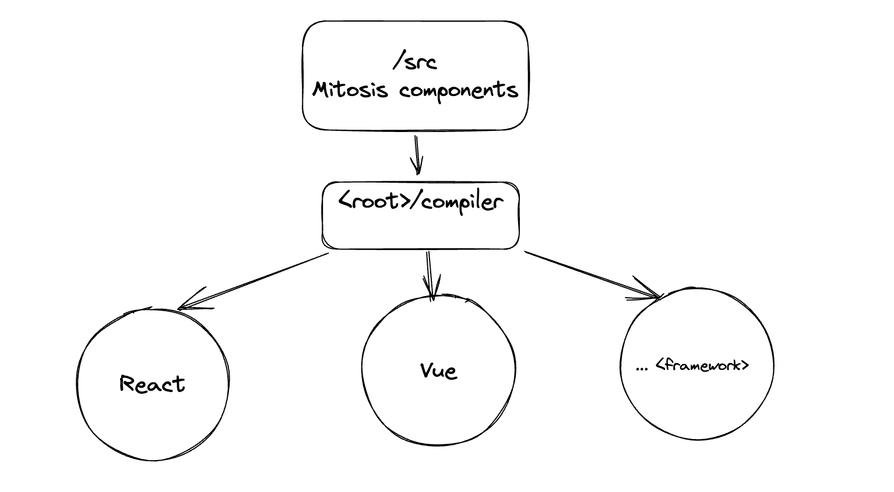

# Interchain UI

<p align="center" width="100%">
   <a href="https://www.npmjs.com/package/interchain-ui"></a>
   <a href="https://www.npmjs.com/package/interchain-ui"></a>
</p>

## Table of contents

- [Interchain UI](#interchain-ui)
  - [Table of contents](#table-of-contents)
  - [🎨 What is Interchain UI?](#-what-is-interchain-ui)
  - [Usage](#usage)
    - [React](#react)
  - [Developing](#developing)
  - [Overview and structure](#overview-and-structure)
  - [Compiler](#compiler)
  - [Icons](#icons)
  - [Related](#related)
  - [Credits](#credits)

## 🎨 What is Interchain UI?

Interchain UI is a foundation library for UI elements used in [cosmos-kit](https://github.com/cosmology-tech/cosmos-kit) and other packages. It provides developers with pre-built components and a foundation for creating user interfaces across different frameworks, such as VueJS, React, Angular, Svelte, SolidJS, and Web Components, enabling developers to customize UI elements and themes. This gives us the ability to code a component once, and it will compile to all framework targets.

## Usage

```bash
# If you use react
yarn add @interchain-ui/react

# If you use vue
yarn add @interchain-ui/vue
```

### React

To see how to use with react, see our react documentation

[Using React](./docs/react.md)

## Developing

- `yarn && yarn bootstrap` to bootstrap the repo
- `yarn dev` to watch the repo for changes and then recompile
- `yarn compile` to compile from mitosis components to other packages, you can give it a flag `-p` or `--platforms` .ie `yarn compile -p react vue`
- `yarn c:react` or `yarn c:vue` to compile specifically to react or vue
- `yarn clean` to clean `.node_modules` or `yarn clean:assets` to clean build/compile output

## Overview and structure


We create components inside a single source of truth folder `<root>/src` with Lite JSX format (`.lite.tsx`), then through our compiler, it's going to compile our components and build it in sub packages' `src` and `dist`.

## Compiler

To know more about the inner workings of our compiler, check  to explore.

## Icons

Check  to know how to add more icons

## Related

Checkout these related projects:

* [@cosmwasm/ts-codegen](https://github.com/CosmWasm/ts-codegen) for generated CosmWasm contract Typescript classes
* [@cosmology/telescope](https://github.com/cosmology-tech/telescope) a "babel for the Cosmos", Telescope is a TypeScript Transpiler for Cosmos Protobufs.
* [chain-registry](https://github.com/cosmology-tech/chain-registry) an npm module for the official Cosmos chain-registry.
* [cosmos-kit](https://github.com/cosmology-tech/cosmos-kit) A wallet connector for the Cosmos ⚛️
* [create-cosmos-app](https://github.com/cosmology-tech/create-cosmos-app) set up a modern Cosmos app by running one command.
* [starship](https://github.com/cosmology-tech/starship) a k8s-based unified development environment for Cosmos Ecosystem

## Credits

Checkout [`mitosis`](https://github.com/BuilderIO/mitosis) from BuilderIO to compile lite JSX. 

🛠 Built by Cosmology — if you like our tools, please consider delegating to [our validator ⚛️](https://cosmology.tech/validator)


