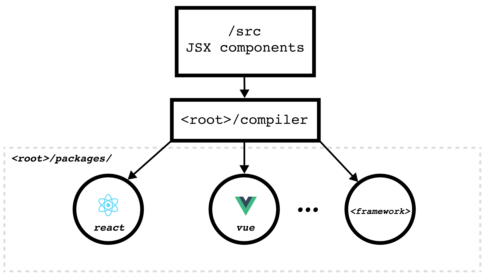

# Interchain UI

<p align="center" width="100%">
    
</p>

<p align="center" width="100%">
The Design System for the Interchain
</p>

<p align="center" width="100%">
  <a href="https://www.npmjs.com/package/@interchain-ui/react"></a>
  <a href="https://github.com/cosmology-tech/interchain-ui/blob/main/LICENSE"></a>
  <a href="https://www.npmjs.com/package/@interchain-ui/react">
    
  </a>
</p>

## Table of contents

- [Interchain UI](#interchain-ui)
  - [Table of contents](#table-of-contents)
  - [🎨 What is Interchain UI?](#-what-is-interchain-ui)
  - [Usage](#usage)
    - [React](#react)
  - [Developing](#developing)
  - [Overview and structure](#overview-and-structure)
  - [Compiler](#compiler)
  - [Icons](#icons)
  - [Customizing theme](#customizing-theme)
  - [Package dev scripts in root package.json](#package-dev-scripts-in-root-packagejson)
  - [Related](#related)
  - [Credits](#credits)

## 🎨 What is Interchain UI?

Interchain UI is a foundation library for UI elements used in [cosmos-kit](https://github.com/cosmology-tech/cosmos-kit) and other packages. It provides developers with pre-built components and a foundation for creating user interfaces across different frameworks, such as VueJS, React, Angular, Svelte, SolidJS, and Web Components, enabling developers to customize UI elements and themes. This gives us the ability to code a component once, and it will compile to all framework targets.

## Usage

```bash
# If you use react
yarn add @interchain-ui/react

# If you use vue
yarn add @interchain-ui/vue
```

### React

To see how to use with react, see our react documentation

[Using React](./docs/react.md)

## Developing

We are using Lerna + PNPM to bootstrap the monorepo. First make sure you install PNPM locally first, then run these commands:

- `pnpm install` to bootstrap the repo
- `pnpm run dev` to watch the repo for changes and then recompile
- `pnpm run compile` to compile from mitosis components to other packages, you can give it a flag `-p` or `--platforms` .ie `pnpm run compile -p react vue`
- `pnpm run c:react` or `pnpm run c:vue` to compile specifically to react or vue
- `pnpm run clear` to clean `.node_modules` or `pnpm run clear:assets` to clean build/compile output
- `pnpm run clear:cache` to clean cache folder used by bundlers

## Overview and structure


We create components inside a single source of truth folder `<root>/src` with Lite JSX format (`.lite.tsx`), then through our compiler, it's going to compile our components and build it in sub packages' `src` and `dist`.

## Compiler

To know more about the inner workings of our compiler, check [Compiler](./docs/compiler.md) to explore.

## Icons

Check [Icon guide](./docs/icons.md) to know how to add more icons

## Customizing theme

Check [Customizing guide](./docs/custom-theme.md) to know how to customize the default theme.

## Package dev scripts in root package.json
- `t:<target>` to compile target framework (t is short for transpile)
- `b:<target>` to bundle target framework
- `c:<target>` to compile and bundle target framework, it's equivalent to sequentially running `pnpm run t:<target> && pnpm run b:<target>`

## Related

Checkout these related projects:

* [@cosmology/telescope](https://github.com/cosmology-tech/telescope) Your Frontend Companion for Building with TypeScript with Cosmos SDK Modules.
* [@cosmwasm/ts-codegen](https://github.com/CosmWasm/ts-codegen) Convert your CosmWasm smart contracts into dev-friendly TypeScript classes.
* [chain-registry](https://github.com/cosmology-tech/chain-registry) Everything from token symbols, logos, and IBC denominations for all assets you want to support in your application.
* [cosmos-kit](https://github.com/cosmology-tech/cosmos-kit) Experience the convenience of connecting with a variety of web3 wallets through a single, streamlined interface.
* [create-cosmos-app](https://github.com/cosmology-tech/create-cosmos-app) Set up a modern Cosmos app by running one command.
* [interchain-ui](https://github.com/cosmology-tech/interchain-ui) The Interchain Design System, empowering developers with a flexible, easy-to-use UI kit.
* [starship](https://github.com/cosmology-tech/starship) Unified Testing and Development for the Interchain.

## Credits

Checkout [`mitosis`](https://github.com/BuilderIO/mitosis) from BuilderIO to compile lite JSX. 

🛠 Built by Cosmology — if you like our tools, please consider delegating to [our validator ⚛️](https://cosmology.zone/validator)
